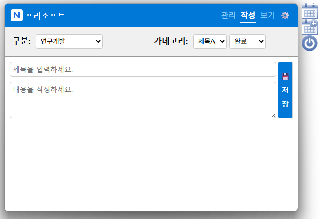

<a href="README_KO.md" style="text-decoration:none; border:1px solid #ccc; padding:4px 8px; border-radius:4px;">한국어</a>
# Weport   
WEPORT(Weekly Report) is a Tauri-based desktop application for creating and managing weekly reports. It's a hybrid application that combines a Rust backend with an HTML/CSS/JavaScript frontend, optimized for Windows environments.   

## Features   
* Report section and category management.   
* Report content viewer.   
* Clipboard copying.   

### Installation   
You need to install the required modules once by running 'pnpm install' in the project's root directory.   

### Distribution Folder Structure   
📂root   
 ├─📂backups
 ├─📂data   
 │  ├─📄wp_manager.json   
 │  ├─📄5497d3bd-c006-4ff2-948a-ad4e40aaa7d9.dat   
 │  └─...   
 ├─📄weport.exe   
 ├─📄aurora4m.exe   
 ├─📄aurora4m.cfg   
 ├─📄aurora4m_lib.dll   
 ├─📄ver.dat   
 ├─📄weport.exe   
 └─📄weport.json   

## Development Tools Versions   
* RUST version: v.1.96.0 (ac68faa20 2026-05-25)   
* RUST edition: 2024   
* TAURI version: v.2.11.3   
* TAURI-CLI version: v.2.11.3   

## Version Information   

### v.1.0.0   
* Initial version    

# Screenshots
* Icon menu   
    
* Report management screen   
    

# Key Development Notes   

## tauri.conf.json   
* tauri.conf.json: Schema file is saved locally for reference (config/v2.json)   
* When using local reference, if issues occur after Tauri version updates, download the file from https://[schema.tauri.app/config/2](https://schema.tauri.app/config/2) and use it.   

## Uncaught TypeError: Cannot read properties of undefined (reading 'core')   
* Occurrence location: const { invoke } = window.__TAURI__.core;   
* When this error occurs in devtools at the above location, you need to rebuild according to the comments in build.rs.   

## Executable file icon not changing   
* Move to the project's root folder in the console and generate the executable file with the `cargo tauri build` command to change the executable file's icon.   

## License

Copyright (C) 2025 Monoslab. All rights reserved.   
This work is licensed under <a rel="license" href="https://github.com/MonosLab/weport?tab=License-1-ov-file">the Business Source License 1.1 - Monoslab (BUSL-1.1-Monoslab)</a>.   